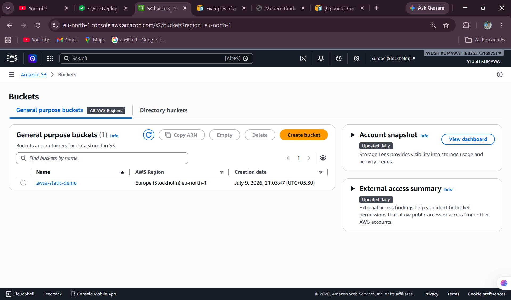
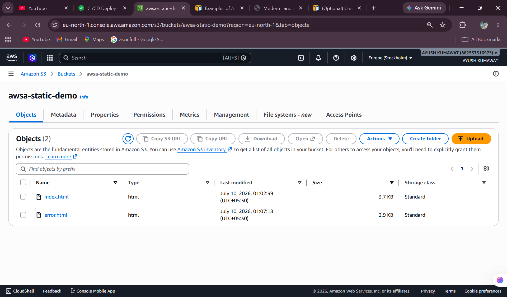
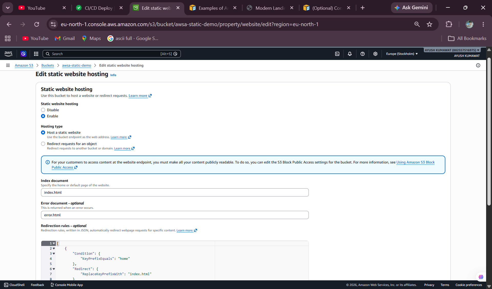
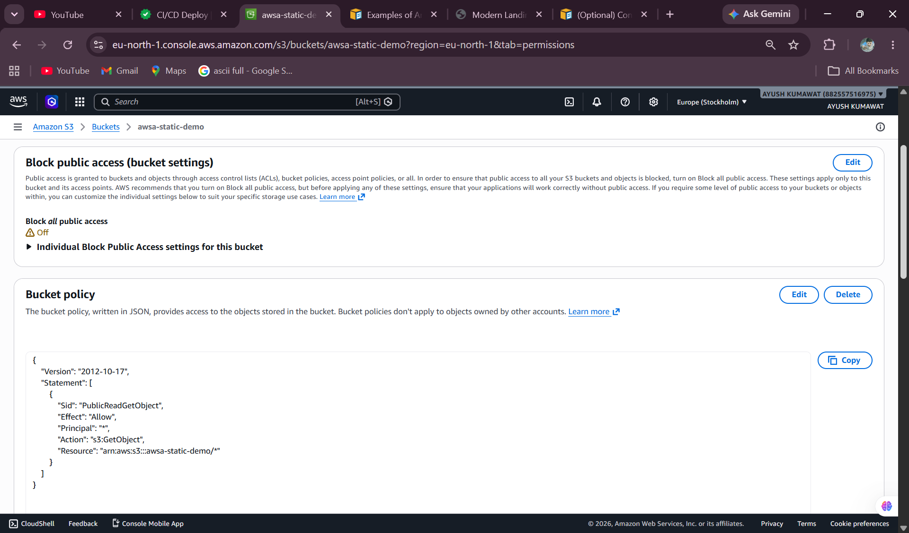
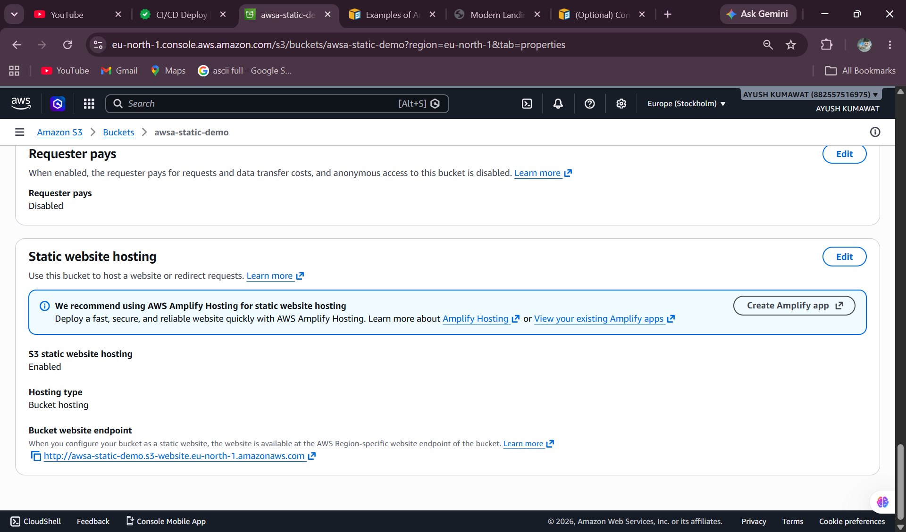
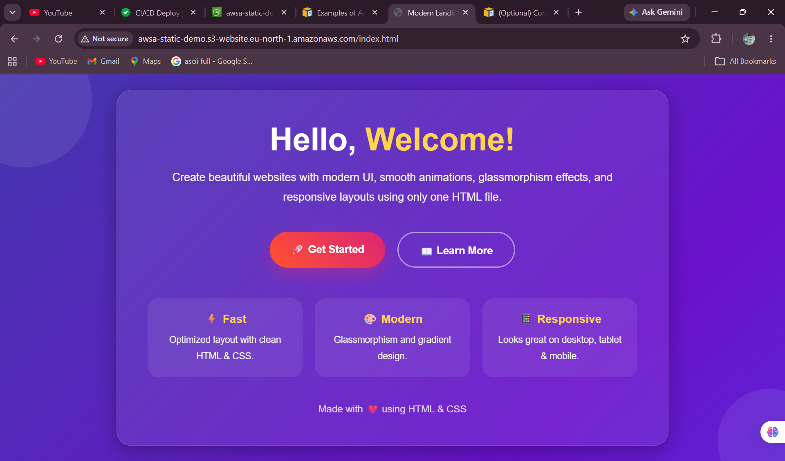
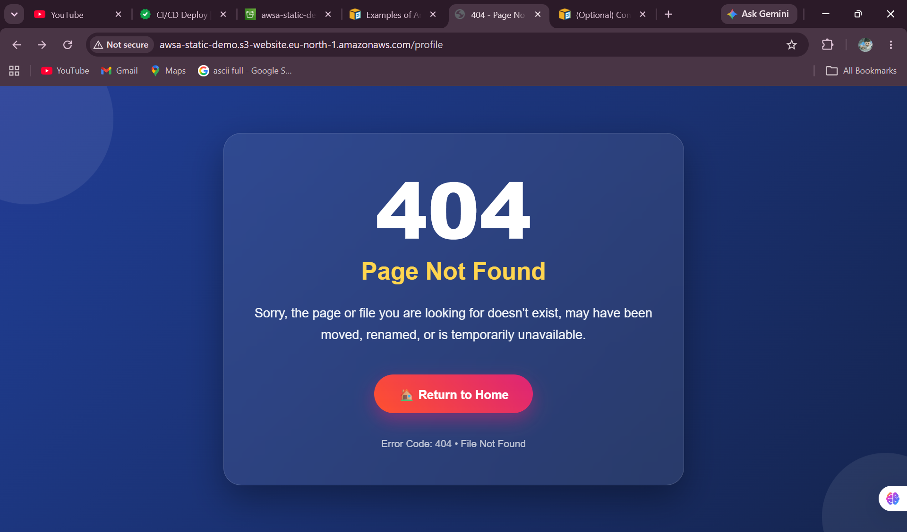

# AWS S3 Static Website Hosting

## Project Overview

This project demonstrates how to host a static website using Amazon S3.

The website is publicly accessible through the Amazon S3 Static Website Endpoint and includes a custom 404 error page.

---

## Services Used

- Amazon S3
- Static Website Hosting
- Bucket Policy
- HTML
- CSS

---

## Implementation Steps

1. Created an Amazon S3 Bucket.
2. Uploaded the website files (index.html and error.html).
3. Enabled Static Website Hosting.
4. Configured Bucket Policy for public access.
5. Accessed the website using the S3 Website Endpoint.
6. Verified the Home Page.
7. Configured a Custom 404 Error Page.

---

## Project Screenshots

Screenshots are available in the **screenshots/** folder.
### 1. S3 Bucket List

### 2. Uploaded Objects

### 3. Static Website Hosting Enabled

### 4. Bucket Policy

### 5. Website Endpoint

### 6. Home Page

### 7. Custom 404 Error Page

---

## Learning Outcomes

- Amazon S3
- Static Website Hosting
- Bucket Policy
- Public Access Configuration
- Website Endpoint
- Custom Error Page